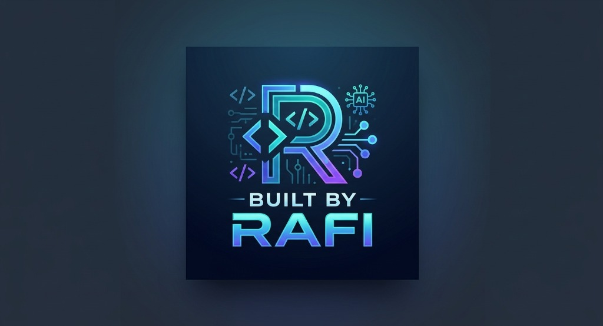

# 🛠️ BUILT BY RAFI — DevToolkit

> An ultra-modern, **100% client-side, privacy-first** developer power suite.  
> Engineered for daily developer workflows. All processing happens entirely within your browser — **zero tracking, zero server calls, zero telemetry**.

<p align="center">
  
</p>

<p align="center">
  <a href="https://dev-toolkit.ffrclup.workers.dev/">
    
  </a>
</p>

<p align="center">
  <a href="./LICENSE"></a>
  <a href="https://vite.dev"></a>
  <a href="https://tailwindcss.com"></a>
  <a href="https://react.dev"></a>
  <a href="https://dev-toolkit.ffrclup.workers.dev/"></a>
</p>

---

## 🌐 Live Application

Access DevToolkit in production directly from anywhere:

👉 **[Launch Live Demo](https://dev-toolkit.ffrclup.workers.dev/)** (`https://dev-toolkit.ffrclup.workers.dev/`)

---

## ⚡ Supercharged Developer Power Suite

### 1. 🔷 JSON Formatter & Schema Studio
- **Format & Minify**: 2-space, 4-space, Tab, and single-line minification.
- **TypeScript Generator**: Convert any JSON structure into typed TypeScript interfaces (`export interface RootObject { ... }`).
- **YAML Converter**: Instant bidirectional JSON to YAML conversion.
- **Precision Error Locator**: Pinpoints syntax errors with exact **Line & Column** coordinates.
- **File Studio**: Upload `.json` files, inspect metrics (depth, keys, byte size), and download outputs.

### 2. 🔑 JWT Decoder & Verifier
- **Color-Coded Token Breakdown**: Segments Header (pink), Payload (yellow), and Signature (emerald).
- **Claim Inspector**: Human-friendly translations for `iss`, `sub`, `aud`, `exp`, `iat`, and `nbf`.
- **Expiration Countdown**: Live calculation showing if a token is active or how long ago it expired.
- **Client-Side Signature Verification**: Test HMAC-SHA256 signatures with custom secrets using native Web Crypto.
- **cURL Header Export**: One-click copy formatted as `Authorization: Bearer <token>`.

### 3. 🔤 Base64 & Data URL Studio
- **Dual Text Modes**: Standard RFC 4648 and URL-safe (`-_`) Base64 with full UTF-8 Unicode support.
- **Image & Asset to Data URL**: Drag & drop or upload PNG, JPG, SVG, WebP files to generate:
  - Base64 Data URLs (`data:image/png;base64,...`)
  - Ready-to-paste CSS `background-image: url(...)`
  - Ready-to-paste HTML `` tags
  - File size vs Base64 payload comparison.

### 4. 🔗 URL & Query Parameter Studio
- **Interactive Query Table**: Parses URLs into an editable key-value parameter table. Add, edit, or delete parameters with real-time synchronized URL rebuilding.
- **Component Encoder / Decoder**: Quickly encode and decode URI components and special characters.

### 5. 🎲 UUID & Identifier Generator
- **RFC 4122 v4 UUID**: Cryptographically secure identifiers generated via `crypto.randomUUID()`.
- **NanoID & Timestamps**: High-performance URL-friendly random IDs and timestamp-based sequential IDs.
- **Bulk Generation**: Generate up to 50 identifiers at once.
- **Customization**: Uppercase, hyphens, and braces (`{...}`) toggles with copy-all lines or JSON array export.

### 6. 🛡️ Hash & HMAC Cryptographic Studio
- **Web Crypto Native**: Computes SHA-256, SHA-512, SHA-384, SHA-1, and MD5 hashes entirely on-device.
- **Keyed HMAC Support**: Compute HMAC signatures using secret keys in real-time.

### 7. 🎯 Regex Tester & Match Debugger
- **Live Match Evaluation**: Instant RegExp testing with flags (`g`, `i`, `m`, `s`).
- **Capture Groups Breakdown**: View matched substrings, start/end indices, and individual capture groups.
- **Quick Presets**: One-click load common patterns (Email, URL, IPv4, UUID, Hex Colors).

### 8. ⌨️ Global Command Palette (`Ctrl + K` / `Cmd + K`)
- Instant keyboard navigation to jump between any tool or action with fuzzy search and arrow keys.

---

## 🔒 Privacy & Security Guarantee

Designed for software architects and engineers dealing with secrets, auth tokens, and sensitive payloads.

| Principle | DevToolkit Implementation |
|---|---|
| **Zero Backend Exposure** | 100% executed locally inside client JavaScript runtime. No API requests are sent. |
| **No Data Retention** | No databases, cookies, or remote logging. Closing or refreshing clears in-memory state. |
| **Local Preferences Only** | Dark/light theme mode preference is preserved locally via browser `localStorage`. |
| **No Tracking or Telemetry** | Zero Google Analytics, tracking pixels, cookies, or third-party monitoring scripts. |

---

## 🚀 Getting Started Locally

```bash
# 1. Clone repository
git clone https://github.com/built-by-rafi/dev-toolkit.git
cd dev-toolkit

# 2. Install dependencies
npm install

# 3. Start local development server
npm run dev
```

Open [http://localhost:5173](http://localhost:5173) in your browser.

---

## 🏗️ Tech Stack

- **Build Engine**: [Vite 6](https://vite.dev)
- **UI Framework**: [React 18](https://react.dev)
- **Styling**: [Tailwind CSS v4](https://tailwindcss.com) (via `@tailwindcss/vite`)
- **Crypto Engine**: Web Crypto API (`crypto.subtle`)
- **Typography**: [Inter](https://fonts.google.com/specimen/Inter)
- **Deployment**: [Cloudflare Workers](https://dev-toolkit.ffrclup.workers.dev/)

---

## 🤝 Contributing

Contributions are welcome! Please read [CONTRIBUTING.md](./CONTRIBUTING.md) for details on our code of conduct and how to submit pull requests.

---

## 📄 License

MIT © 2024 DevToolkit — Engineered with 💜 by **Rafi**. See [LICENSE](./LICENSE) for details.
